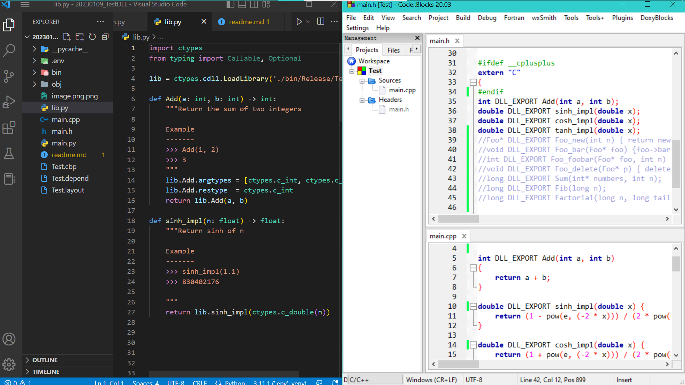

# Python call C++ DLL

Build C++ DLL to obfuscate core functionalities of my code (IP) or gain speed,

then call it from Python via `ctypes` module.

## Changelog

- ver0.01: 20230109

## Author

Zhang Liang

## Collaborate in the same workspace

Collaborate `Code::Blocks` and `VS Code`.

1. using `Code::Blocks` to create workspace
2. using `VS Code` to open it as a paralell layout



## Create C++ source files

Build C++ configuration in WINOS.

- compiler: `GNU C++`
- ide: `code::blocks`
- build config: `g++.exe -O2 -Wall -std=c++17 -m64 -DBUILD_DLL -Wextra -Wall -std=gnu++17 -m64  -c xxx\main.o`
- template: `New Project` -> `Dynamic Link Library`

### C++ DLL template

1. header file: `main.h` includes headers as usual
2. source file: `main.cpp` include implementations as usual

#### Gotcha

All C++ code must be exposed to C code in `extern "C"{ ... }` so that Python can call later on.

- Python does not talk to C++ code directly.
- `function overload` is not allowed in C code.
- `function / class template` is not allowed in C code.

#### Example: Basic DLL funcitons

This is a basic example.

```C++
// main.h

#ifndef __MAIN_H__
#define __MAIN_H__

// include libraries
#include <windows.h>
#include <cmath>
#include <iostream>
#include <algorithm>

// declare class / struct / enum / const here
const double e = 2.7182818284590452353602874713527;

#ifdef BUILD_DLL
    #define DLL_EXPORT __declspec(dllexport)
#else
    #define DLL_EXPORT __declspec(dllimport)
#endif


#ifdef __cplusplus
extern "C"
{
#endif
    // declare and expose
    // my
    // functions
    // here
    int DLL_EXPORT Add(int a, int b);
    double DLL_EXPORT sinh_impl(double x);
    double DLL_EXPORT cosh_impl(double x);
    double DLL_EXPORT tanh_impl(double x);
#ifdef __cplusplus
}
#endif

#endif // __MAIN_H__

```

```C++
// main.cpp

#include "main.h"

// keywrod DLL_EXPORT is optional in main.h
int DLL_EXPORT Add(int a, int b)
{ return a + b; }

double sinh_impl(double x)
{ return (1 - pow(e, (-2 * x))) / (2 * pow(e, -x)); }

double cosh_impl(double x)
{ return (1 + pow(e, (-2 * x))) / (2 * pow(e, -x)); }

double tanh_impl(double x)
{ return sinh_impl(x) / cosh_impl(x); }

```

#### Example: Basic DLL Array as args

This is a bare example.

```C++
// main.h

#ifndef __MAIN_H__
#define __MAIN_H__

// include libraries
#include <windows.h>
#include <cmath>
#include <iostream>
#include <algorithm>

// declare class / struct / enum / const here

#ifdef BUILD_DLL
    #define DLL_EXPORT __declspec(dllexport)
#else
    #define DLL_EXPORT __declspec(dllimport)
#endif


#ifdef __cplusplus
extern "C"
{
#endif
    long DLL_EXPORT Sum(long*, long);
#ifdef __cplusplus
}
#endif

#endif // __MAIN_H__

```

```C++
// main.cpp

#include "main.h"

long Sum(long* numbers, long n)
{
    long total = 0;
    for(int i = 0; i < n; i++) {
        total += numbers[i];
    }
    return total;
}

```

#### Example: Basic DLL class

This is a bare example.

```C++
// main.h

#ifndef __MAIN_H__
#define __MAIN_H__

// include libraries
#include <windows.h>
#include <cmath>
#include <iostream>

// declare class / struct / enum / const here
class Foo
{
    private:
        int val;
    public:
        Foo(int);
        ~Foo(void);
        void bar(void);
        int add(int);
}

#ifdef BUILD_DLL
    #define DLL_EXPORT __declspec(dllexport)
#else
    #define DLL_EXPORT __declspec(dllimport)
#endif


#ifdef __cplusplus
extern "C"
{
#endif
    Foo* DLL_EXPORT Foo_new(int n);
    void DLL_EXPORT Foo_bar(Foo* f);
    int DLL_EXPORT Foo_add(Foo* f, int val);
    void DLL_EXPORT Foo_del(Foo* f);
#ifdef __cplusplus
}
#endif

#endif // __MAIN_H__

```

```C++
// main.cpp

#include "main.h"

Foo::Foo(int n)
{ this->val = n; }

void Foo::bar()
{ std::cout << "Value is " << this->val << std::endl; }

int Foo::add(int n)
{ return this->val + n; }

Foo::~Foo(void)
{ std::cout << "DLL Foo object is deleted from memory" << std::endl; }

Foo* DLL_EXPORT Foo_new(int n)
{ return new Foo(n); }

void DLL_EXPORT Foo_bar(Foo* f)
{ return f->bar(); }

int DLL_EXPORT Foo_add(Foo* f, int n)
{ return f->add(n); }

void DLL_EXPORT Foo_del(Foo* f)
{ delete f; }

```

### Build C++ DLL

Utilize the following approach to config DLL project of `Code::Blocks`.

using `local` workspace build configuration, rather than `global`.

1. Step 1: Right click on `ProjectName`, choose `Build options...`, config
2. Step 2: Right click on `ProjectName`, choose `Build` or `Rebuild` after source code changes

## Create wrappers in Python

There are two ways to wrap C++ DLL functions in Python.

1. Method 1: `declare argtypes, restype via ctypes.c_xxx types`, then `pass` them to the correct C++ DLL functions
2. Method 2: `pass` argtypes wrapped in corresponding `ctypes.c_xxx types` to correct C++ DLL functions

## Build Python configuration in WINOS

- compiler: `Python3.xx ('.env':venv)`
- ide: `VS Code`
- build config: `Python -u main.py`

Here is an example.

```Python
# lib.py

import ctypes

lib = ctypes.cdll.LoadLibrary('my/fold/to/Test.dll')

def Add(a: int, b: int) -> int:
    """Return the sum of two integers

    Example
    -------
    >>> Add(1, 2)
    >>> 3        
    """
    lib.Add.argtypes = [ctypes.c_int, ctypes.c_int]
    lib.Add.restype  = ctypes.c_int
    return lib.Add(a, b)

def sinh_impl(n: float) -> float:
    """Return sinh of n

    Example
    -------
    >>> sinh_impl(1.1)
    >>> 830402176

    """
    return lib.sinh_impl(ctypes.c_double(n))

def Sum(arr: list[int]) -> int:
    """Return the sum of a list with element of integers

    Example
    -------
    >>> Sum([1, 2, 3])
    >>> 6
    >>> Sum(range(10))
    >>> 45

    """
    if not arr:
        raise ValueError('arr must not be None')

    if not isinstance(arr[0], int):
        raise ValueError('arr must be a list of integers')

    size: int = len(arr)
    IntArray = ctypes.c_int * size # max size is 32 though otherwise stackoverflow occurs
    numbers = IntArray(*arr)
    return lib.Sum(numbers, size)

class Foo:
    def __init__(self, n: int) -> None:
        lib.Foo_new.argtypes = [ctypes.c_int]
        lib.Foo_new.restype = ctypes.c_void_p

        lib.Foo_bar.argtypes = [ctypes.c_void_p]
        lib.Foo_bar.restype = ctypes.c_void_p

        lib.Foo_foobar.argtypes = [ctypes.c_void_p, ctypes.c_int]
        lib.Foo_foobar.restype = ctypes.c_int

        lib.Foo_del.argtypes = [ctypes.c_void_p]
        lib.Foo_del.restype = ctypes.c_void_p

        self.obj = lib.Foo_new(n)

    def bar(self) -> None:
        lib.Foo_bar(self.obj)

    def add(self, val: int) -> int:
        return lib.Foo_foobar(self.obj, val)

    def __del__(self) -> None:
        lib.Foo_del(self.obj)

```

```Python
# main.py

from lib import Foo, Sum
import timeit

def main() -> None:
    f: Foo = Foo(5)
    f.bar()
    print(f.add(7))
    x = f.add(2)
    print(type(x))
    del f
    print(Sum(range(10)))
    res: float = timeit.timeit(stmt='Sum(range(1000))', setup='from lib import Sum', number=1000)
    print(res)

if __name__ == '__main__':
    main()

```

## Reference

1. [https://www.auctoris.co.uk/2017/04/29/calling-c-classes-from-python-with-ctypes/]
2. [https://chrisheydrick.com/2016/02/06/passing-a-ctypes-array-of-struct-from-python-to-dll/]
3. [https://www.gamedev.net/forums/topic/696442-pass-array-from-dll-to-python/]
4. [https://www.appsloveworld.com/cplus/100/21/how-to-return-array-from-c-function-to-python-using-ctypes]

## Licence

The MIT License (MIT)

Permission is hereby granted, free of charge, to any person obtaining a copy of this software and associated documentation files (the “Software”), to deal in the Software without restriction, including without limitation the rights to use, copy, modify, merge, publish, distribute, sublicense, and/or sell copies of the Software, and to permit persons to whom the Software is furnished to do so, subject to the following conditions:

The above copyright notice and this permission notice shall be included in all copies or substantial portions of the Software.

THE SOFTWARE IS PROVIDED “AS IS”, WITHOUT WARRANTY OF ANY KIND, EXPRESS OR IMPLIED, INCLUDING BUT NOT LIMITED TO THE WARRANTIES OF MERCHANTABILITY, FITNESS FOR A PARTICULAR PURPOSE AND NONINFRINGEMENT. IN NO EVENT SHALL THE AUTHORS OR COPYRIGHT HOLDERS BE LIABLE FOR ANY CLAIM, DAMAGES OR OTHER LIABILITY, WHETHER IN AN ACTION OF CONTRACT, TORT OR OTHERWISE, ARISING FROM, OUT OF OR IN CONNECTION WITH THE SOFTWARE OR THE USE OR OTHER DEALINGS IN THE SOFTWARE.
