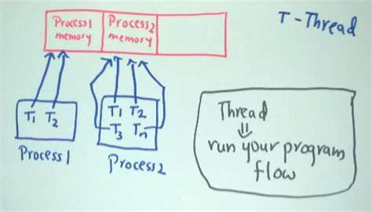
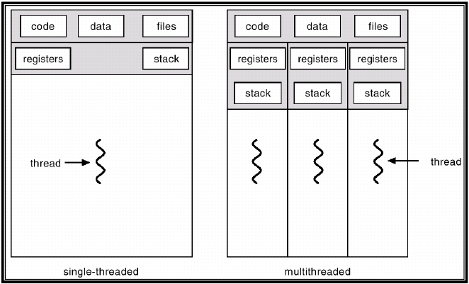

# Thread vs Process

I had encountered `thread` and `process` many times.

My brain's pressure becomes high, blood pressure mixes with fury every f*cking time.

I get sick of brain damage and tired of this shit.

Here is my way to understand these two high-level concepts.

## What?

So what is `thread`? 

what is `process`?


### OIP



### Diff


### Model



### Combination


## Show me the codes pls

[C# - Thread vs Process](http://www.albahari.com/threading/)

```C#
class ThreadTest
{
  static void Main()
  {
    Thread t = new Thread (WriteY);          // Kick off a new thread
    t.Start();                               // running WriteY()
 
    // Simultaneously, do something on the main thread.
    for (int i = 0; i < 1000; i++) Console.Write ("x");
  }
 
  static void WriteY()
  {
    for (int i = 0; i < 1000; i++) Console.Write ("y");
  }
}
```

```
// result
xxxxxxxxxxxxxxxxyyyyyyyyyyyyyyyyyyyyyyyyyyyyyyyyyyyyy
xxxxxxxxxxxxxxxxxxxxxxxxxxxxxxxxxxxxxxxxyyyyyyyyyyyyy
yyyyyyyyyyyyyyyyyyyyyyyyyyyyyyyxxxxxxxxxxxxxxxxxxxxxx
xxxxxxxxxxxxxxxxxxxxxxyyyyyyyyyyyyyyyyyyyyyyyyyyyyyyy
yyyyyyyyyyyyyxxxxxxxxxxxxxxxxxxxxxxxxxxxxxxxxxxxxxxxx
...
```


```C#
class ThreadSafe 
{
  static bool done;
  static readonly object locker = new object();
 
  static void Main()
  {
    new Thread (Go).Start();
    Go();
  }
 
  static void Go()
  {
    lock (locker)
    {
      if (!done) { Console.WriteLine ("Done"); done = true; }
    }
  }
}
```

```
??????????
```

```C#
class ThreadTest
{
  bool done;
  static void Main()
  {
    ThreadTest tt = new ThreadTest(); // Create a common instance
    new Thread (tt.Go).Start();
    tt.Go();
  }

  // Note that Go is now an instance method
  void Go()
  {
    if (!done) { done = true; Console.WriteLine ("Done"); }
  }
}
```

```
Done
```

```C#
class ThreadTest
{
  static bool done; // Static fields are shared between all threads
  static void Main()
  {
    new Thread (Go).Start();
    Go();
  }

  static void Go()
  {
    if (!done) { done = true; Console.WriteLine ("Done"); }
  }
}
```

vs

```C#
class ThreadTest
{
  static bool done; // Static fields are shared between all threads
  static void Main()
  {
    new Thread (Go).Start();
    Go();
  }

  static void Go()
  {
    if (!done) { Console.WriteLine ("Done"); done = true; }
  }
}
```

```
Done
Done (usually!)
```

```C#
class ThreadSafe
{
  static bool done;
  static readonly object locker = new object();
  static void Main()
  {
    new Thread (Go).Start();
    Go();
  }
  
  static void Go()
  {
    lock (locker)
    {
      if (!done) { Console.WriteLine ("Done"); done = true; }
    }
  }
}
```

## Threads vs Processes

A thread is analogous to the operating system process in which your application runs.

Just as processes run in parallel on a computer,
threads run in parallel within a signle process.

Processes are fully isolated from each other;
threads have just a limited degree of isolation.

In particular, threads share (heap) memory with other threads running in the same application.

This, in part, why threading is useful: 
one thread can fetch data in the background, for instance, while another thread can display the data as it arrives.

## Threading's uses and misuses

### uses

- Maintaining a responsive user interface
- Making effecient use of an otherwise blocked CPU
- Parallel programming
- Speculative execution
- Allowing requests to be processed simultaneously


## About

Copyright &copy; 2020 ZL

All rights reserved.

The MIT License (MIT)

Permission is hereby granted, free of charge, to any person obtaining a copy
of this software and associated documentation files (the "Software"), to deal
in the Software without restriction, including without limitation the rights
to use, copy, modify, merge, publish, distribute, sublicense, and/or sell
copies of the Software, and to permit persons to whom the Software is
furnished to do so, subject to the following conditions:

The above copyright notice and this permission notice shall be included in all
copies or substantial portions of the Software.

THE SOFTWARE IS PROVIDED "AS IS", WITHOUT WARRANTY OF ANY KIND, EXPRESS OR
IMPLIED, INCLUDING BUT NOT LIMITED TO THE WARRANTIES OF MERCHANTABILITY,
FITNESS FOR A PARTICULAR PURPOSE AND NONINFRINGEMENT. IN NO EVENT SHALL THE
AUTHORS OR COPYRIGHT HOLDERS BE LIABLE FOR ANY CLAIM, DAMAGES OR OTHER
LIABILITY, WHETHER IN AN ACTION OF CONTRACT, TORT OR OTHERWISE, ARISING FROM,
OUT OF OR IN CONNECTION WITH THE SOFTWARE OR THE USE OR OTHER DEALINGS IN THE
SOFTWARE.
